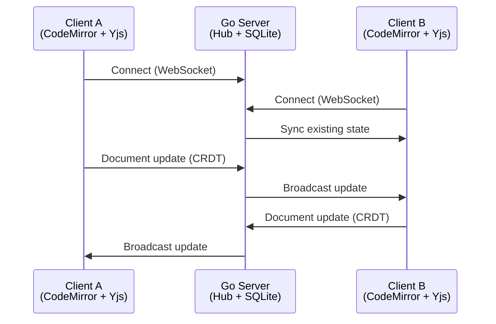

# 🌸 Lattice

**Real-Time Collaborative Code Editor** — *Where ideas blossom together*

Lattice is a Google Docs-style collaborative code editor that enables multiple users to write code together in real-time. Built with a focus on seamless collaboration, Lattice ensures that **conflicts are mathematically impossible** through the use of CRDTs (Conflict-free Replicated Data Types).


---

## ✨ Features

### Editor
- CodeMirror 6 with syntax highlighting for 15+ languages
- Custom cherry blossom theme
- Code folding, bracket matching, auto-close
- Keyboard shortcuts (undo, redo, find, comment)

### Collaboration
- Real-time sync via Yjs CRDTs
- Remote cursor awareness with colored cursors
- User presence bar with avatars
- "Who's typing" indicator

### Backend
- WebSocket hub with room-based broadcasting
- SQLite persistence for document recovery
- Rate limiting for API endpoints
- Graceful shutdown with cleanup

### Deployment
- Docker multi-stage builds
- Docker Compose orchestration
- Nginx reverse proxy with WebSocket support
- Health checks for all services

---

## 📦 Tech Stack

| Layer | Technology |
|-------|------------|
| **Frontend** | React 18, TypeScript 5, Vite 5 |
| **Editor** | CodeMirror 6, y-codemirror.next |
| **CRDT** | Yjs, lib0 |
| **Backend** | Go 1.21, Gorilla WebSocket |
| **Database** | SQLite (modernc.org/sqlite) |
| **Transport** | WebSocket (custom sync protocol) |
| **Styling** | CSS Modules, CSS Variables |
| **Testing** | Vitest, Playwright, Go testing |
| **Deployment** | Docker, Docker Compose, Nginx |

---

## 🛠 Installation

### Prerequisites

- **Go** 1.21 or higher
- **Node.js** 18 or higher
- **npm** (or pnpm/yarn)
- **Docker** & **Docker Compose** (optional, for containerized deployment)

### Clone the Repository

```bash
git clone https://github.com/manpreetbhatti/lattice.git
cd lattice
```

### Install Dependencies

**Backend:**
```bash
cd backend
go mod tidy
```

**Frontend:**
```bash
cd frontend
npm install
```

---

## 🚀 Running the Application

### Option 1: Local Development (Recommended for Development)

Using Make:
```bash
make dev          # Starts both backend and frontend concurrently
```

Or start services individually:

**Backend** (runs on http://localhost:8080):
```bash
cd backend
go run cmd/server/main.go
```

**Frontend** (runs on http://localhost:3000):
```bash
cd frontend
npm run dev
```

### Option 2: Docker (Recommended for Production)

**Quick Start:**
```bash
make build        # Build Docker images
make up           # Start all services
```

Or using docker-compose directly:
```bash
docker-compose build
docker-compose up -d
```

**Production Mode** (with Nginx reverse proxy):
```bash
make prod
# Or: docker-compose --profile production up -d
```

**Docker Commands:**
```bash
make logs         # View logs
make down         # Stop services
make clean        # Remove containers and volumes
make status       # Check container status and health
```

### Accessing the Application

| Mode | Frontend | Backend |
|------|----------|---------|
| Development | http://localhost:3000 | http://localhost:8080 |
| Docker | http://localhost:3000 | http://localhost:8080 |
| Production | http://localhost | (proxied through Nginx) |

---

## 🧪 Testing

### Run All Tests

```bash
make test-all     # Runs backend, frontend, and E2E tests
```

### Backend Tests (Go)

```bash
make test-backend                    # With coverage and verbose output

# Or manually:
cd backend
go test ./...                        # Run all tests
go test ./... -v                     # Verbose output
go test ./... -cover                 # With coverage
go test -run TestConcurrent ./...    # Run specific tests
```

### Frontend Unit Tests (Vitest)

```bash
make test-frontend                   # Run unit tests

# Or manually:
cd frontend
npm test                             # Run once
npm run test:watch                   # Watch mode
```

### End-to-End Tests (Playwright)

> **Note:** E2E tests require the backend and frontend servers to be running.

```bash
make test-e2e                        # Run E2E tests
make test-e2e-ui                     # Interactive UI mode

# Or manually:
cd frontend
npm run test:e2e                     # Run all E2E tests
npm run test:e2e:ui                  # Interactive mode
npx playwright test --project=chromium  # Specific browser
```

### Test Coverage Summary

| Layer | Framework | Tests |
|-------|-----------|-------|
| Backend DB | Go testing | Room CRUD, Updates, Snapshots |
| Backend Hub | Go testing | Broadcast, Client registration |
| Backend API | Go testing | REST endpoints, Pagination |
| Frontend CRDT | Vitest | Y.Doc integration, Awareness |
| Frontend Hooks | Vitest | useLattice hook |
| E2E Collaboration | Playwright | Multi-user sync, Presence |

---

## 🔧 Development Commands

```bash
make help         # Show all available commands
make dev          # Start both backend and frontend
make dev-backend  # Start backend only
make dev-frontend # Start frontend only
make test         # Run backend + frontend unit tests
make lint         # Run linters (go vet + eslint)
make db-reset     # Reset the SQLite database
```

---

## 🏗 Architecture



**How CRDTs Work:**

When two users type at the same position simultaneously:
- **Traditional editors:** One change wins, the other is lost (conflict!)
- **Lattice:** Both changes merge deterministically using Yjs's YATA algorithm — no data loss, ever.

---

## 🌐 REST API

| Endpoint | Method | Description |
|----------|--------|-------------|
| `/health` | GET | Health check |
| `/api/stats` | GET | Server statistics |
| `/api/rooms` | GET | List all rooms |
| `/api/rooms` | POST | Create a room |
| `/api/rooms/{id}` | GET | Get room details |
| `/api/rooms/{id}` | DELETE | Delete a room |

---

## ⌨️ Keyboard Shortcuts

| Action | Windows/Linux | Mac |
|--------|---------------|-----|
| Undo | `Ctrl+Z` | `⌘+Z` |
| Redo | `Ctrl+Shift+Z` | `⌘+Shift+Z` |
| Find | `Ctrl+F` | `⌘+F` |
| Toggle comment | `Ctrl+/` | `⌘+/` |
| Indent | `Tab` | `Tab` |
| Outdent | `Shift+Tab` | `Shift+Tab` |
| Select next occurrence | `Ctrl+D` | `⌘+D` |
| Select all occurrences | `Ctrl+Shift+L` | `⌘+Shift+L` |
| Go to line | `Ctrl+G` | `⌘+G` |
| Duplicate line | `Ctrl+Shift+D` | `⌘+Shift+D` |

---

## 🎨 Supported Languages

| Language | Extension | Language | Extension |
|----------|-----------|----------|-----------|
| JavaScript | `.js` | Python | `.py` |
| TypeScript | `.ts` | Go | `.go` |
| JSX | `.jsx` | Rust | `.rs` |
| TSX | `.tsx` | C/C++ | `.c`, `.cpp` |
| HTML | `.html` | Java | `.java` |
| CSS | `.css` | SQL | `.sql` |
| JSON | `.json` | Markdown | `.md` |